# Going for Gold!

#### [Live link to deployed project](https://going-for-gold.netlify.app/)

[Going for Gold](https://going-for-gold.netlify.app/) offers a fairer, more measured look at the Tokyo 2020 Olympic medal count. Countries are ranked in relative (per capita) instead of absolute medal-winning terms. Site visitors can toggle between two different ranking breakdowns, as well as search for countries, contact the site owner and enable dark mode. Fully interactive and boasting a robust and coherent mobile-first design, Going for Gold makes clever use of the React ecosystem to give users a richly dynamic UI. The application leverages the REST Countries API as well as a local JSON Olympic dataset to render lightning-fast statistical analyses. React Context API and EmailJS integration - the latter bolstered by custom form validation and error handling - round out a distinctly memorable user experience.

## User Experience (UX)

It is imperative in today's on-the-move, remote-working consumer landscape that an interactive frontend site such as Going for Gold be fully-responsive across a wide range of devices and screen sizes. This overarching principle, coupled with a desire to create something sleek and modern-looking, informed my work from the first design sketch right through to the full production build. In terms of conceptual inspiration, my initial 'Eureka moment' arrived after coming across [this thought-provoking Olympic-themed LinkedIn post](https://www.linkedin.com/feed/update/urn:li:activity:6830398833353117697/). Added to the fact that the Tokyo Games themselves had just concluded, this sent me down a rabbit hole of Olympics-related data, blog posts and visualisations of various kinds until a clear theme for the site began to emerge. [React](https://reactjs.org/), together with a selection of its tributary libraries and dependencies, was chosen to power things under the hood, as its speed and versatility when it comes to rendering (and rerendering) user interfaces is second to none. I chose to go it alone in terms of design/styling, so no frameworks like Bootstrap or Tailwind CSS were used anywhere in the application's stylesheet. The project's title, meanwhile, is of course a respectful nod to [the greatest TV game show of all time](https://www.youtube.com/watch?v=lTjVNwYRCNk)

## Project design

### Colour scheme:

  

  <b>click to view</b>
  

In some respects, the choices for the site's colour scheme were somewhat ready-made, as I decided from the off to incorporate the five instantly-recognisable colours found in the [Olympic rings logo](https://en.wikipedia.org/wiki/Olympic_symbols#Rings), as well as an approximate shade to represent each medal colour (gold, silver and bronze). Similarly, the navy blue colour used extensively as a background/secondary colour throughout the site is taken from the ['Harmonised chequered emblem'](https://olympics.com/tokyo-2020/en/games/emblem/) designed by Japanese artist Asao Tokolo and chosen as the Games' official logo.

### Typography:

  

  <b>click to view</b>
  

The official Tokyo 2020 font was developed by [Morisawa](https://olympics.com/tokyo-2020/en/news/morisawa-official-font-tokyo-2020), a Japanese type foundry, and appears to be unavailable for public use. After a bit of digging, I therefore decided to use the [Freeroad Regular font](https://webfonts.ffonts.net/Freeroad-Regular.font), which is a close approximation of the ["industrial `sans serif`"](https://fontmeme.com/images/TOKYO-2020-NEW.gif) seen in the Games' [(redesigned)](https://www.theguardian.com/sport/2016/apr/25/tokyo-2020-organisers-unveil-new-logo-olympic-plagiarism-allegations) [logo](https://fontmeme.com/images/TOKYO-2020-NEW.gif), for all primary headings across the site. To complement this, I chose [Raleway](https://fonts.google.com/specimen/Raleway?query=raleway), a popular `sans serif` font available via Google Fonts, as the default `body` font.

### Wireframes:

  

  <b>click to view</b>
  

## Features

### Existing features:

- #### [Landing page:](https://going-for-gold.netlify.app/)

  

  <b>click to view</b>
  

As showcased in the [images above](#going-for-gold), the first thing the user sees upon landing is a visually appealing Olympic rings logo animation (lasting approximately four seconds), followed by a further trickle-down/fade-in animation effect involving a trio of call-to-action buttons (one representing each Olympic medal category of gold ('MEDALLISTS'), silver ('ABOUT') and bronze ('CONTACT')). These three buttons are centred on all screen sizes, and act as de facto navigational aids in lieu of the site's actual navigation menu (which has been hidden here in an effort not to overload visitors with too much information within the first few seconds). Clicking on any one of these CTA buttons takes the user to the page denoted by the button text.

- #### [Medallists page:](https://going-for-gold.netlify.app/medallists)

  

    

    <b>click to view</b>
    

  |  | 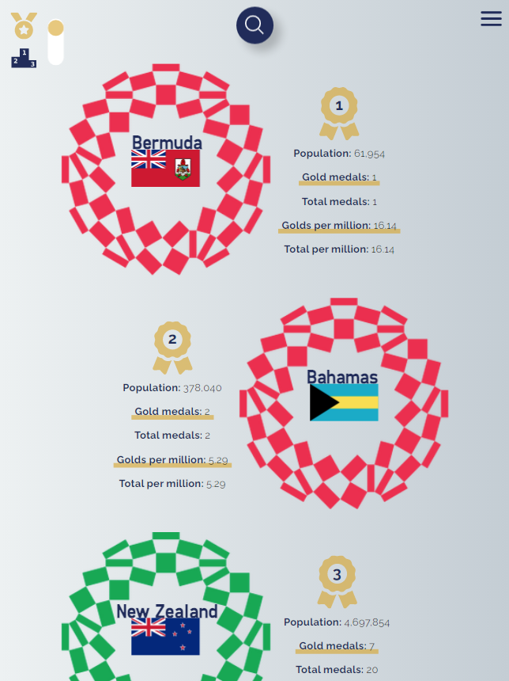 | 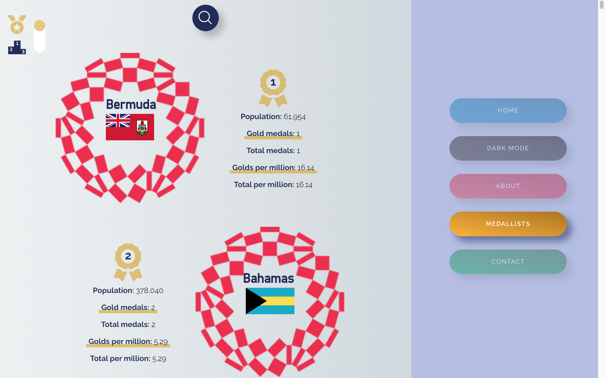 |
  | :------------------------------------------------: | :------------------------------------------------: | :-------------------------------------------------: |
  |                       mobile                       |                       tablet                       |                       desktop                       |

  The Medallists page is the site's main page content-wise. In its default state, it gives a list of all 93 medal-winning countries from the Tokyo Games with a breakdown of the following data for each individual country:

  - National flag (pulled from a REST Countries API endpoint)
  - Country name (as above)
  - Population (as above)
  - Gold medals won at Tokyo 2020 (taken from the app's local data file)
  - Gold medals per one million citizens (calculated from the two relevant figures above)
  - Total medals won at Tokyo 2020 (taken from the app's local data file)
  - Total medals per one million citizens (calculated from the two relevant figures above)

  | 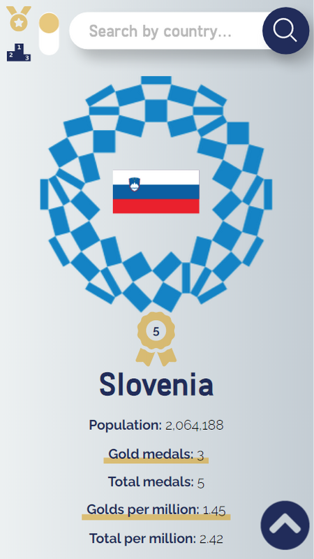 |  | 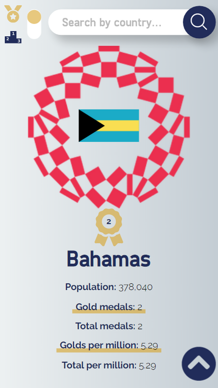 | 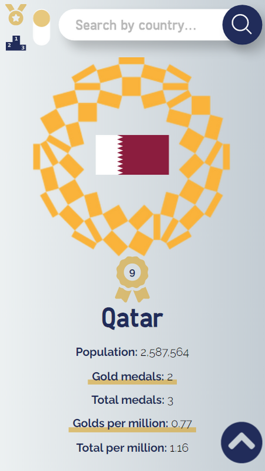 |  |
  | :---------------------------------------------------: | :---------------------------------------------------: | :-----------------------------------------------------: | :-------------------------------------------------: | :----------------------------------------------------: |
  |                     blue (Europe)                     |                    black (Africa)                     |                     red (Americas)                      |                    yellow (Asia)                    |                    green (Oceania)                     |

  In addition to this, the UI for each medallist includes a dynamically-rendered background image consisting of the aforementioned Tokyo 2020 emblem in the relevant Olympic ring colour that corresponds to that country's continent. Initially, these `.container-flag` elements were being differentially coloured based on their index number (using array iteration). It was actually my mentor Tim who alerted me to the fact that the five Olympic ring colours [represent the five main continents](https://en.wikipedia.org/wiki/Olympic_symbols#:~:text=The%201949%E2%80%9350%20edition%20of,%2C%20and%20red%20for%20America%22). After learning of this, I was able to conditionally target the `background-image` property of each of these elements based on the "region" property value of each corresponding item returned from the REST Countries API endpoint.

  |  |
  | :-------------------------------------------------: |
  |                    `<FaAward />`                    |

  One more feature displayed for each medallist is a dynamically-rendered React Icon with numerical ranking corresponding to that particular country's standing (these values are bound to the index of each country when iterating through the overall array)

- #### [About page:](https://going-for-gold.netlify.app/about)

  

    

    <b>click to view</b>
    

  | 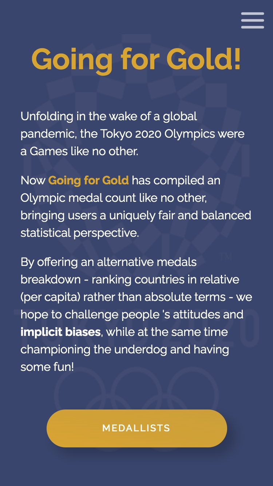 | 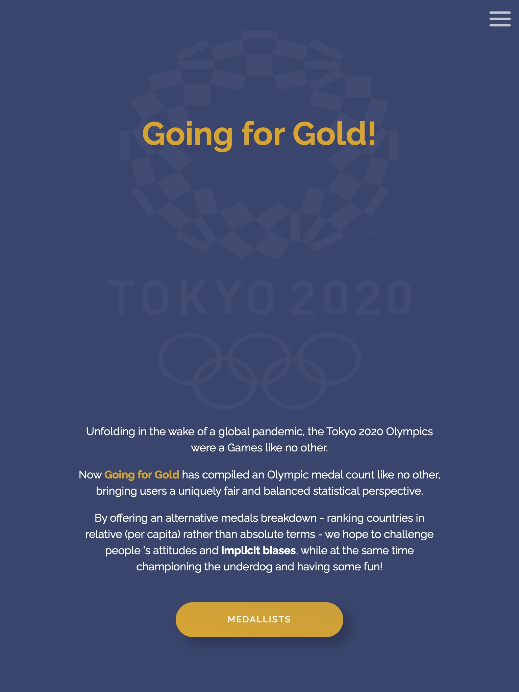 | 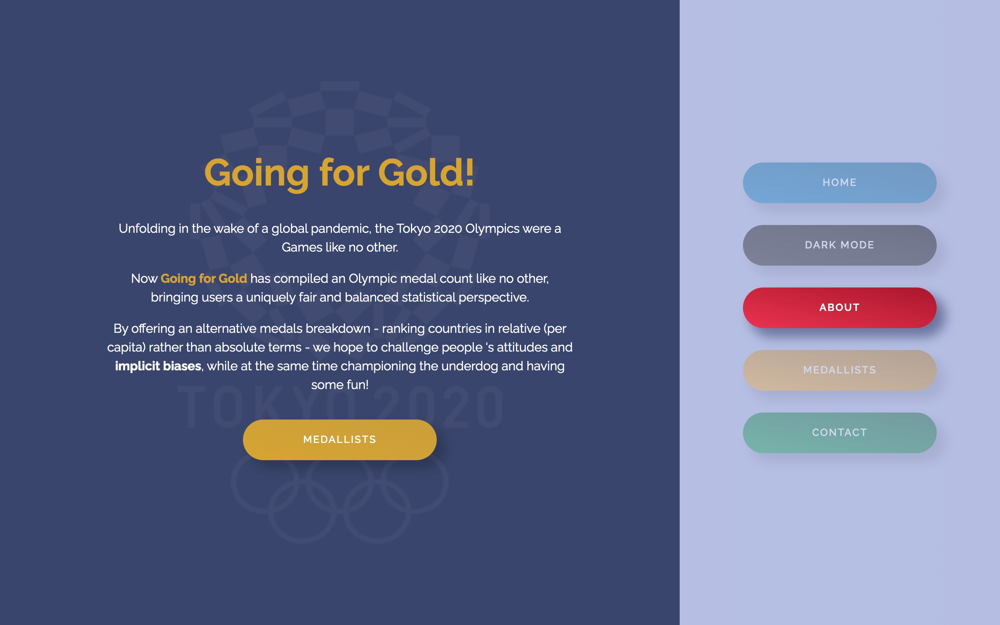 |
  | :----------------------------------------------: | :----------------------------------------------: | :-----------------------------------------------: |
  |                      mobile                      |                      tablet                      |                      desktop                      |

  As you might expect, the site's About page presents users with a brief rundown on the site's purpose and intentions - all done in an engaging and aesthetically-pleasing manner. The parent `.container-about` element has been styled with a faint Tokyo 2020 logo `background-image`, while the page's main UI elements (heading, paragraphs of text and a bright CTA button) all transition into view thanks to staggered CSS `animation` effects on tablet and desktop (see image below)

  |  |
  | :---------------------------------------------------------------------: |
  |                          About page animation                           |

- #### [Contact page:](https://going-for-gold.netlify.app/contact)

  

    

    <b>click to view</b>
    

  | 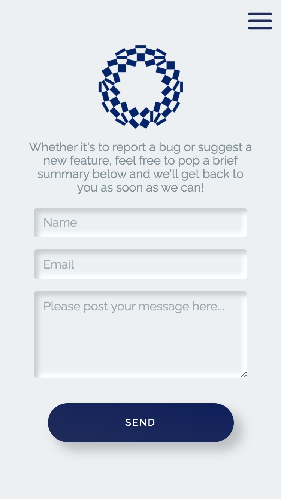 | 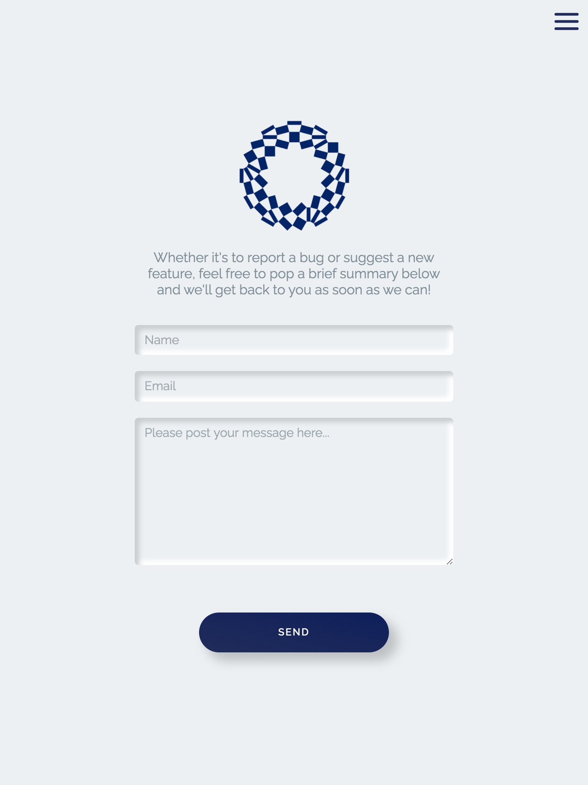 |  |
  | :------------------------------------------------: | :------------------------------------------------: | :-------------------------------------------------: |
  |                       mobile                       |                       tablet                       |                       desktop                       |

  As with most Contact pages, a `form` element is the centrepiece of this section of the site. Going for Gold's form boasts a neumorphic design, and is vertically and horizontally centred across all device sizes. A concise form submission sequence comprising two `input` fields followed by a `textarea` and a 'SEND' button means the user is not bombarded with too many requests or criteria. Strict form validation (outlined in detail below) has nevertheless been put into place to constrain user input. Once the form has been successfully submitted, the user is taken to a custom confirmation screen, which also contains a helpful CTA button guiding them back to the Home page.

  | 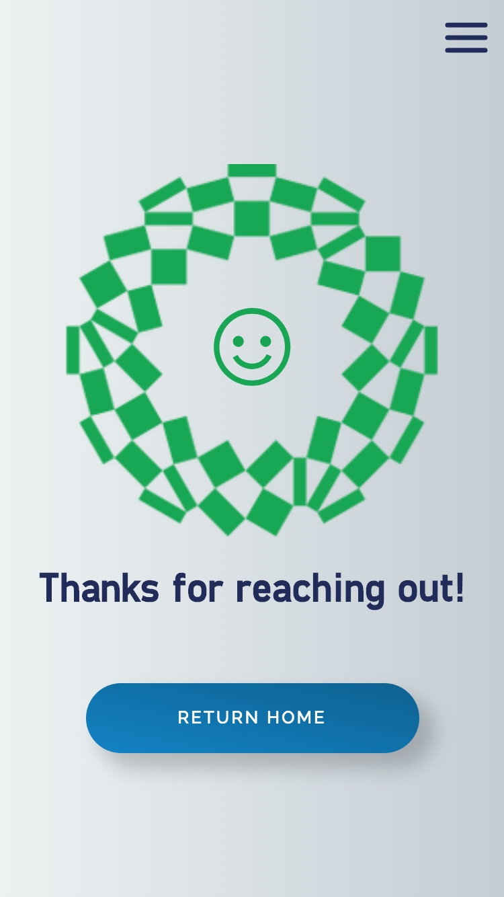 | 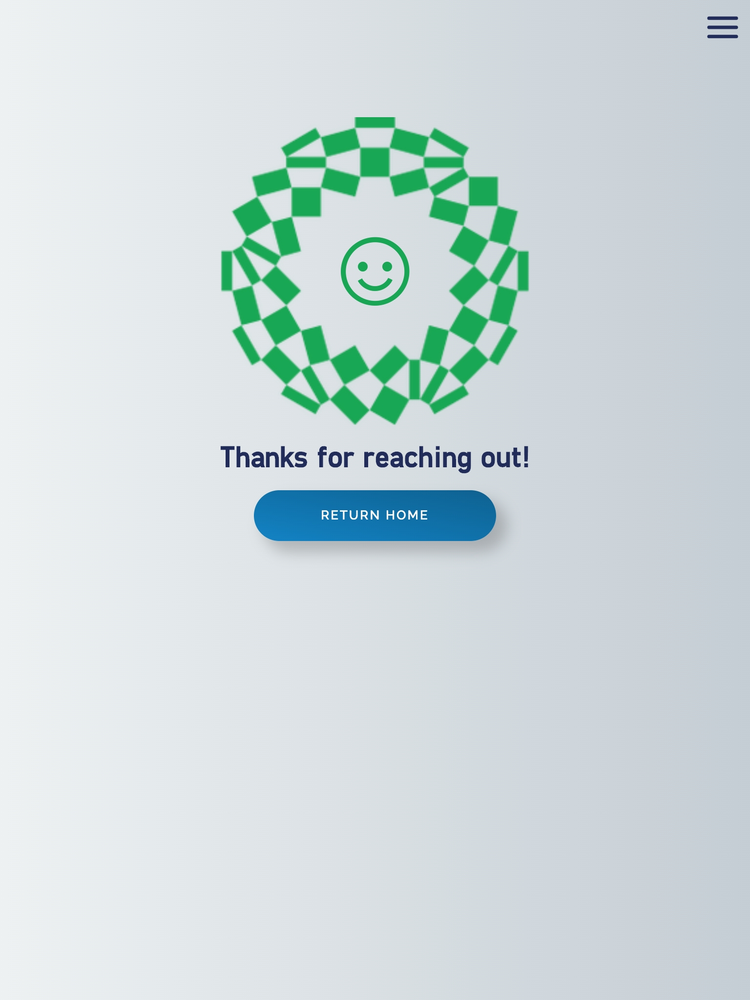 | 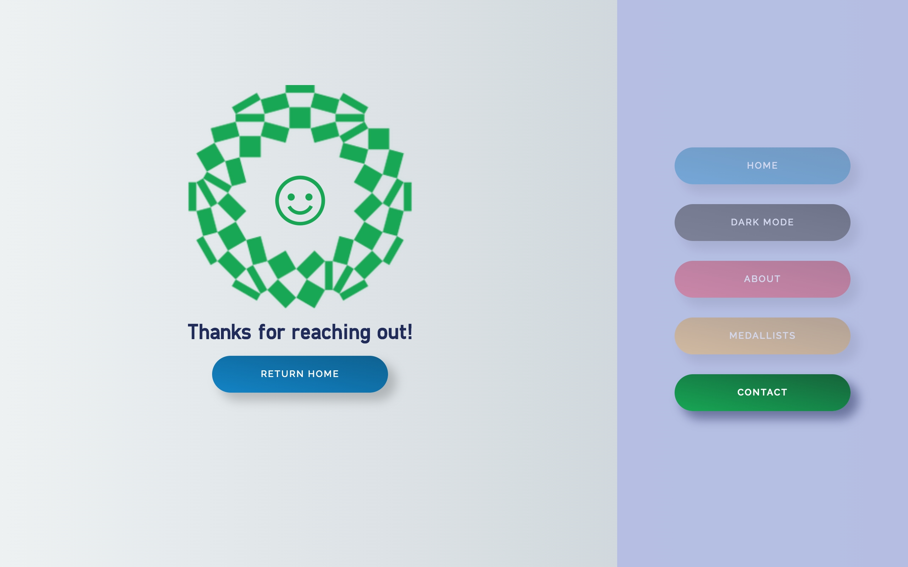 |
  | :-------------------------------------------------------------: | :-------------------------------------------------------------: | :--------------------------------------------------------------: |
  |                             mobile                              |                             tablet                              |                             desktop                              |

### Potential future features:

  

  <b>click to view</b>
  

- #### Individual breakout pages for each country:

  Given more time, I would have been able to build this expanded feature into the current version of the app. A standalone component could be dynamically populated with more granular information about each country's medal haul: for example, appropriate use of React icons could highlight the Olympic events in which that particular nation was successful. Names of athletes/winners could also be listed, perhaps along with a more detailed look at that country's Olympic Games success rate historically.

- #### Aggregate the data to compile relative medal-winning stats for each of the five continents represented by the Olympic rings:

  This would be a fun and interesting add-on I feel, and would once again shine a slightly alternative light on what is a veritable ocean of Olympics-related stats and datasets. It would actually be quite easy to implement, and could similarly be used to run down both total and per capita figures for each continent.

- #### Expand the scope of the project to also incorporate the Tokyo 2020 Paralympic Games:

  More than just a nice-to-have, this is a feature that ought really to have been included from the start in the current MVP. However, three factors combined to prevent me from readily including corresponding figures for Paralympic medal-winning countries:

  - There simply isn't the same availability of data (and/or APIs) related to the Paralympics, so a good bit more digging would have been required to find appropriately malleable numbers
  - The Paralympic Games were still actually taking place throughout most of this project's development life cycle, and so trying to gather data would necessarily have constituted something of a 'moving target' exercise
  - Finally, as is so often the case, the project deadline approached quicker than I would have liked, and I was mindful of [not falling into the familiar trap](https://quotefancy.com/quote/757101/Tom-Cargill-The-first-90-percent-of-the-code-accounts-for-the-first-90-percent-of-the) of feature creep

- #### ["Infinite scroll"](https://www.npmjs.com/package/react-infinite-scroll-component) and/or pagination:

  One of a number of necessary trade-offs made to ensure the overall project made it over the finish line inside its submission dealine. A dynamic 'back-to-top' button component has been put in place to compensate for the absence of both of the above, and it is hoped this will help improve UX sufficiently until such time as I'm able to add these convenient features.

- #### Site-wide dark mode:

  At present, the user is only able to toggle dark mode on or off while browsing the main Medallists page. Ideally, this feature should be available throughout the application to give a more coherent and complete feel. However, it's worth noting that the site's [About page](https://going-for-gold.netlify.app/about) has been styled with a 'dark mode-like' background colour by default, and that the neumorphic styling that's been applied to the [Contact form](https://going-for-gold.netlify.app/contact) would also likely be affected by dark mode being enabled there.
  

A truly level playing field...

[Official Tokyo 2020 Olympic Medal Count](https://olympics.com/tokyo-2020/olympic-games/en/results/all-sports/medal-standings.htm)

[Local `JSON` file created by copying and pasting data found in this (archived) repository](https://github.com/kevinle-1/olympic-api)

[Olympic flag image downloaded from Wikipedia](https://upload.wikimedia.org/wikipedia/commons/thumb/a/a7/Olympic_flag.svg/640px-Olympic_flag.svg.png)

[Chequered Tokyo 2020 logo downloaded from Wikipedia and customised for use throughout the site](https://upload.wikimedia.org/wikipedia/sco/1/1d/2020_Summer_Olympics_logo_new.svg)

['3D Transforms and Animations'](https://www.the-art-of-web.com/css/3d-transforms/) (The Art of Web)

['Fetch API'](https://developer.mozilla.org/en-US/docs/Web/API/Fetch_API) (MDN Web Docs)

[REST Countries API](https://restcountries.eu/)

[Problematic API endpoint for Kosovo: `"cioc":null`](https://restcountries.eu/rest/v2/alpha/xk)

[Dynamic pure CSS search bar refactored and customised from Jove Angelevski's template](https://codepen.io/AlbertFeynman/pen/BPvzWZ)

[Landing page Olympic rings SVG GSAP animation adapted from Steve Gardner's CodePen](https://codepen.io/ste-vg/details/kXzXYW)

[Animated loading component adapted from @CodeBoomer's 'Olympics CSS Spinner' CodePen](https://codepen.io/CodeBoomer/pen/BzOPPz/)

[ColorSpace's online colour gradient generator](https://mycolor.space/gradient) was used to apply a metallic shine effect to the gold-, silver- and bronze-coloured landing page buttons, and to create the linear gradients found elsewhere throughout the site.

The [JPG to PNG online editing tool](https://jpg2png.com/) was used to convert a `.jpeg` version of the Tokyo 2020 logo to `.png` format

['How to sort an array of objects by multiple fields?'](https://stackoverflow.com/questions/6913512/how-to-sort-an-array-of-objects-by-multiple-fields) (Stack Overflow)

['URL Parameters (`Params`)'](https://reactrouter.com/web/example/url-params) (React Router Docs)

['Detect click on back button using React useEffect and useState'](https://egghead.io/lessons/egghead-detect-click-on-back-button-using-react-useeffect-y-usestate) (egghead.io)

['Ternary operator on style with React Js Es 6'](https://stackoverflow.com/questions/41092677/ternary-operator-on-style-with-react-js-es-6) (Stack Overflow)

i followed the advice of [this answer](https://stackoverflow.com/a/22480938/12176426) to [this Stack Overflow query](https://stackoverflow.com/questions/487073/how-to-check-if-element-is-visible-after-scrolling) in order to dynamically add a CSS animation class to country flags when they are (vertically) scrolled into view

[Summary of the situation surrounding Russian (ROC) athletes' participation at the Tokyo Games](https://en.wikipedia.org/wiki/Russian_Olympic_Committee_athletes_at_the_2020_Summer_Olympics) (Wikipedia)

I had to intercept the data being returned from the REST Countries API for Russia: changing the name from ['Russian Federation'](https://restcountries.eu/rest/v2/name/russia) to 'ROC' and the flag image's `src` value to [a URL found on the official Olympics.com website](https://olympics.com/tokyo-2020/olympic-games/resCOMMON/img/flags/ROC.png).

Likewise, the outdated name of ['Macedonia (the former Yugoslav Republic of)'](https://restcountries.eu/rest/v2/name/macedonia) in the REST Countries API database was overwritten with the correct modern name of 'North Macedonia'

I also decided to abbreviate the verbose country name versions of ['Venezuela (Bolivarian Republic of)'](https://restcountries.eu/rest/v2/name/venezuela), [United States of America](https://restcountries.eu/rest/v2/name/usa), [Syrian Arab Republic](https://restcountries.eu/rest/v2/name/syria), [Moldova (Republic of)](https://restcountries.eu/rest/v2/name/moldova), [Korea (Republic of)](https://restcountries.eu/rest/v2/alpha/kr), [Iran (Islamic Republic of)](https://restcountries.eu/rest/v2/name/iran) and ['Republic of Kosovo'](https://restcountries.eu/rest/v2/name/kosovo), in keeping with the site's overall minimalist aesthetic

The situation in relation to Great Britain/The United Kingdom (or "Team GB", as they are informally known nowadays) at the Olympics is naturally [quite complicated](https://en.wikipedia.org/wiki/Team_GB#Calls_for_renaming) and [frequently](https://inews.co.uk/sport/olympics/team-gb-why-not-uk-olympics-tokyo-2020-name-british-explained-1122737) [misunderstood](https://twitter.com/daraobriain/status/1418897202471227394). Either way, seeing as the official Olympic website adheres to [calling them 'Great Britain'](https://olympics.com/tokyo-2020/olympic-games/en/results/all-sports/medal-standings.htm), this was the preferred nomenclature adopted by the developer. To that end, the lengthy name of ['United Kingdom of Great Britain and Northern Ireland' returned from the API endpoint](https://restcountries.eu/rest/v2/name/great%20britain) was reformatted manually through the use of conditional logic within the Medallists component.

[Guidance on additional configuration requirements to facilitate continuous deployment (via Netlify) from John Smilga](https://www.udemy.com/course/react-tutorial-and-projects-course/learn/lecture/22778973#content)

Inspiration for applying dynamic colour styles to the `.container-flag` elements on the [Medallists page](https://going-for-gold.netlify.app/medallists) came from my mentor Tim, who alerted me to the fact that the five Olympic ring colours [represent the five main continents](https://en.wikipedia.org/wiki/Olympic_symbols#:~:text=The%201949%E2%80%9350%20edition%20of,%2C%20and%20red%20for%20America%22). After learning of this, I was able to conditionally target the `background-image` property of each of these elements based on the "region" property value of each corresponding item returned from the REST Countries API endpoint.

['How to print a number with commas as thousands separators in JavaScript'](https://stackoverflow.com/questions/2901102/how-to-print-a-number-with-commas-as-thousands-separators-in-javascript) (Stack Overflow)

[Box Shadow CSS Generator](https://cssgenerator.org/box-shadow-css-generator.html)

CSS toggle-switch functionality adapted (for integration with React state values) [from Nick Bottomley's CodePen](https://codepen.io/nickbottomley/pen/uhfmn)

Favicon generated using the [free online favicon.io tool](https://favicon.io/favicon-converter/)

Responsive.ly app

The site's [neumorphic Contact `form`](https://going-for-gold.netlify.app/contact/) is loosely based on the aesthetic of the developer's own [portfolio site Contact page](https://loosenthedark.tech/contact.html) - which in turn took inspiration from [this CSS-Tricks deep dive](https://css-tricks.com/neumorphism-and-css/) on the design trend

['Search Filter React Tutorial - Search Bar in React'](https://www.youtube.com/watch?v=mZvKPtH9Fzo) (PedroTech on YouTube)

['JavaScript regexp to validate Name with special characters like apostrophe, and spaces'](https://stackoverflow.com/questions/24754914/javascript-regexp-to-validate-name-with-special-characters-like-apostrophe-and) (Stack Overflow)

['Installation'](https://www.emailjs.com/docs/sdk/installation/) and ['Examples > React'](https://www.emailjs.com/docs/examples/reactjs/) (EmailJS Docs) were used as references for EmailJS React installation and component configuration

['Trigger 'resize' event on component?'](https://stackoverflow.com/questions/37775020/trigger-resize-event-on-component) (Stack Overflow) led me to...

...[react-resize-detector](https://www.npmjs.com/package/react-resize-detector): _"Handle element resizes like it's 2021!"_ was imported and used to check for the search input box changing size in order to dismiss the error message when it's not required | [live demo](http://maslianok.github.io/react-resize-detector/)

## Features

### Potential future features:

- The flag images returned from the REST Countries API are not of uniform dimensions, which presents challenges in terms of layout. This is something that could be addressed more thoroughly further down the line (for the time being, some basic contingency CSS has been put in place), e.g. by applying dynamic styling to the `.flag-wrapper` elements and their contents to ensure standardised width/height for each double-sided flag.

- Make the 'rank icons' beneath each medallist's flag/logo UI _less_ dynamic, i.e. so that they aren't bound by array index values when a user searches for and locates their country/countries of choice
